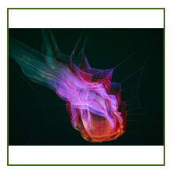

# Image Resizer

[](https://travis-ci.org/ligadigital/image-resizer)

[](https://raw.githubusercontent.com/ligadigital/image-resizer/master/LICENSE)
[](https://www.npmjs.com/package/@ligadigital/image-resizer)

A service to resize images on the fly.

## Usage

```
GET /:mode/:size/:host-and-path
```

### Modes

Must be one of the following:

* `resize`  
  Resizes the image to fit into the target size and keeps the ratio.
* `shrink`  
  Behaves the same as `resize` but does not upscale the image.
* `crop`  
  Crops the image to the target size.
* `resizefit`

### Size

Must be in one of the following formats:

* `100x100` (width and height)
* `100x`    (width only)
* `x100`    (height only)


## Installation

### Global npm package

Install package
```shell
# yarn
yarn global add @ligadigital/image-resizer

# npm
npm install -g @ligadigital/image-resizer
```

Start server
```shell
image-resizer --port=3000
```

For all commandline flags see:
```shell
image-resizer --help
```

### Docker

```
docker build -t ligadigital/image-resizer .
docker run -p 4000:4000 ligadigital/image-resizer
```

### Local npm package


```JavaScript
const server = require('@ligadigital/image-resizer');
server({ port: 3000 })
  .then((listener) => console.log(`Listening on *:${listener.address().port)}`)
  .catch(error => console.error(error.stack || error));
```

## Examples

### `resize` / `shrink`

```
GET /resize/200x200/example.org/image.png
```

* Target: 200px x 200px
* Actual: 200px x 150px (original ration)


### `crop`

```
GET /crop/200x200/example.org/image.png
```

* Target: 200px x 200px
* Actual: 200px x 200px


```
GET /crop/100x100/example.org/my-image.jpeg
```

### `resizefit`

```
GET /resizefit/200x200/example.org/image.png
```

* Target: 200px x 200px
* Actual: 200px x 200px



## Storage

### S3

If a S3 bucket is configured the process works like this:

* Request app requests image from `S3` bucket
* **If the image does not exist**, `S3` redirects to the image-resizer
  * `image-resizer` resizes the image un puts it on `S3`
  * `image-resizer` redirects back to `S3`
* **If the image exist**, `S3` serves the image

**Example s3 Routing rule**

```XML
<RoutingRules>
  <RoutingRule>
    <Condition>
      <KeyPrefixEquals>image-resizer/</KeyPrefixEquals>
      <HttpErrorCodeReturnedEquals>404</HttpErrorCodeReturnedEquals>
    </Condition>
    <Redirect>
      <Protocol>https</Protocol>
      <HostName>example.org</HostName>
      <ReplaceKeyPrefixWith>image-resizer/</ReplaceKeyPrefixWith>
      <HttpRedirectCode>302</HttpRedirectCode>
    </Redirect>
  </RoutingRule>
</RoutingRules>
```


## Configuration

All configuration is done via environment variables:

- **S3_BUCKET** (e.g. `images`)
- **S3_PATH"**  (e.g. `image-resizer`)
- **S3_URL**    (e.g. `http://example.s3-website.eu-central-1.amazonaws.com`)
- **S3_ACCESS_KEY_ID**
- **S3_SECRET_ACCESS_KEY**


## Dependencies

* [ImageMagick](http://www.imagemagick.org/)
* [GraphicsMagick](http://www.graphicsmagick.org/)
* [gifsicle](https://www.lcdf.org/gifsicle/)


On Mac:

```
brew install imagemagick graphicsmagick gifsicle
```

## TODOs

* [ ] Make tmp/ dir configurable
* [ ] Publish docker image
* [ ] Better documentation
* [ ] Drop node 4 support
* [ ] Options to whitelist or blacklist hosts
* [ ] Handle GET parameter

## License

[MIT © LIGADIGITAL AG](LICENSE)
